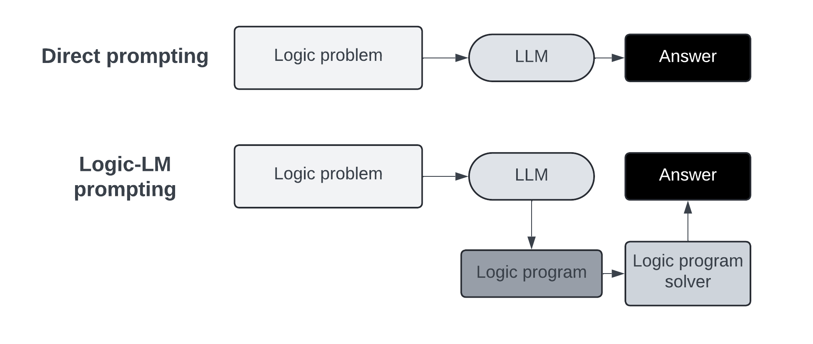
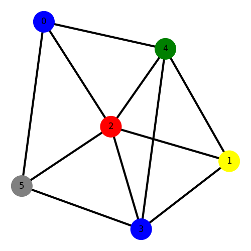
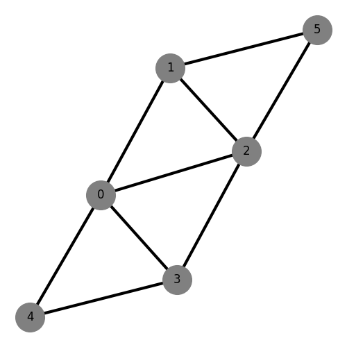
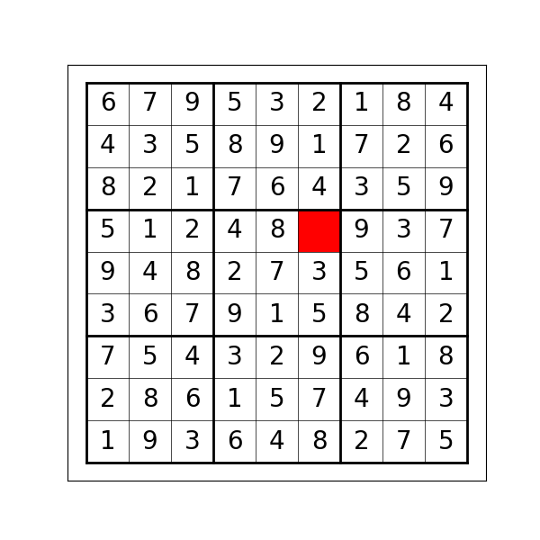
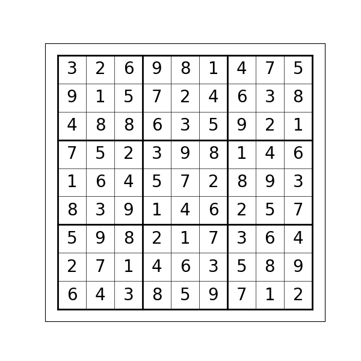
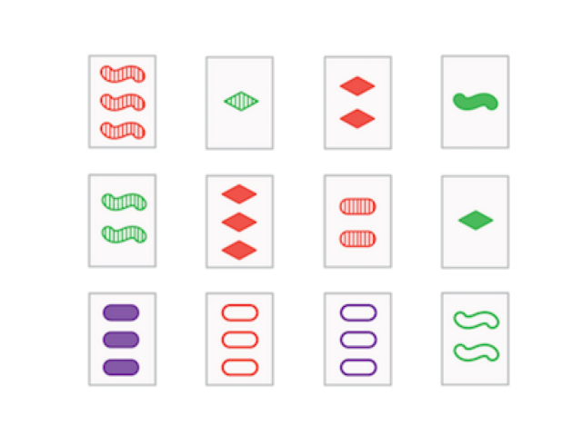
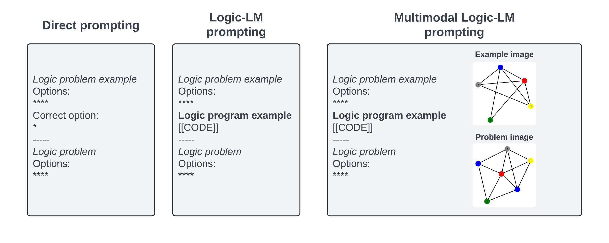

# Logic-LM: Empowering Large Language Models with Symbolic Solvers for Faithful Logical Reasoning

### Chimène Blokesch, Dominykas Šeputis, Idries Nasim, Job Gräber, Soham Chatterjee

---

## 1. Introduction

Large Language Models (LLMs) have ushered in a new era in natural language understanding, demonstrating exceptional performance across a wide array of tasks. Despite their achievements rooted in identifying statistical patterns and contextual associations, LLMs face notable limitations in performing complex logical reasoning.

A major limitation is that they do not seem to contain an identifiable, reliable reasoning mechanism that is sound and complete. Although LLMs excel at capturing surface-level semantics and context, they lack the explicit reasoning methods that humans employ to construct formal proofs or derive conclusions from premises [(Liu et al., 2023b)](https://arxiv.org/abs/2304.03439). Representing intricate logical structures like quantification, predication, and entailment poses a significant challenge. Moreover, the faithfulness of LLMs—including their consistency, coherence, and adherence to logical rules—is often compromised. Consequently, they might produce responses that sound plausible but fall short of true logical validity. This shortcoming is particularly glaring in tasks demanding precise and long logical inferences.

Additionally, LLMs are prone to hallucinations—inaccurately generating information that seems correct but is actually false. This can lead them to hallucinate wrong answers instead of using a sound logical inference grounded in the truth of the premises. The inherent ambiguity of natural language presents further obstacles. LLMs frequently rely on statistical probabilities to resolve ambiguities, which can result in occasional errors or misinterpretations. In logical reasoning, where precise disambiguation is essential, this reliance can be particularly detrimental.

<br/>
<p align="center">
    
</p>
<br/>

In response to these weaknesses, the [Logic-LM](https://github.com/teacherpeterpan/Logic-LLM) framework has been introduced.

This innovative approach integrates the capabilities of LLMs to grasp and deal with diverse text input with the precision of symbolic solvers. Logic-LM begins by converting natural language problem descriptions into symbolic representations, effectively bridging the gap between human-readable text and the rigorous language of logic. Once a symbolic formulation is established, a deterministic symbolic solver takes over. Unlike LLMs, which seem to be limited to statistically derived heuristics, these solvers strictly adhere to the rules of formal systems for there are provable guarantees about preserving truth during the inference steps.

Inspired by the proposed solution of enhancing LLMs' logical problem-solving capabilities by integrating symbolic solvers into the workflow, this blog aims to replicate and expand upon the results presented in ["Logic-LM: Empowering Large Language Models with Symbolic Solvers for Faithful Logical Reasoning"](https://arxiv.org/pdf/2305.12295). The objectives of this blog are as follows:

1. Clarify Logic-LM's framework and methodology.
2. Replicate the results from the paper, expanding on the ablation studies.
3. Explore the capabilities of different LLM families within the context of Logic-LM.
4. Investigate the multi-modal reasoning capabilities of Logic-LM.

### 1.1 Logic-LM Framework

The basic proposal of the Logic-LM framework is summarized schematically in the figure below. In the standard (or 'direct prompting') approach, a LLM has to directly map a logic problem to an answer, thereby being solely responsible for grasping the problem statement, performing (implicitly or explicitly) a chain of reasoning and arriving at an answer.

<br/>
<p align="center">
  
</p>
<br/>

The Logic-LM framework instead divides the process into smaller steps. It proposes to burden the LLM with just grasping the problem and finding a logical representation of the problem.

1. **Logic problem -> LLM -> Logic program**: This step involves identifying the relevant entities, facts, and rules within the problem statement, effectively translating human-readable text into a structured logical representation. We will give an example of such a representation in section 2.1. This step also involves in-context learning, where a few examples of such transformations into the proper syntax are prepended to the prompt.

2. **Logic program -> Logic program solver**: Doing inference with this representation is not done with the LLM, but with a symbolic solver that encodes our best theories of correct and efficient formal reasoning. If something went wrong in the previous step and the logic program cannot be parsed by the solver, then as a 'backup' a random answer could be given, or it could fall back on the baseline, direct prompting approach.

3. **Logic program solver -> Answer**: In the final stage, a final answer is decided. In our experiments, this follows straightforwardly from the solver because we can let it generate logic programs that lead to a choice between the options. In the case of more open-ended problems, one could use a LLM to extract a legible answer from the output of the logic program solver instead.

### 1.2 Logic programs

> If you are deeply familiar with logic programming, you may skip this section, because what follows is a quick introduction or refresher.

Logic programming is a programming paradigm that is particularly well-suited for tasks involving symbolic reasoning and knowledge representation. It is fundamentally different from imperative programming in that it expresses computation through logical declarations and relationships rather than explicit control flow. In logic programming, problems are formulated as a set of logical statements, often in the form of predicates, which describe facts and rules about problems within a given domain. The most well-known logic programming language is Prolog.

In Prolog, computation is driven by the engine's attempt to satisfy queries by systematically searching for and applying rules and facts. The declarative nature of logic programming often leads to more concise, flexible, and understandable code, as it allows programmers to focus on “what” needs to be achieved rather than “how” to achieve it. For example, below you can see a simple program that seeks to find which of the given birds can fly:

```prolog
% First, we define the facts about the birds, where object is a type of bird and each bird has a name.
penguin(tweety).
parrot(polly).
sparrow(sid).
broken_wing(sid).
ostrich(olga).

% Next, we define the rules that determine whether a previously defined object is a bird.
bird(X) :- penguin(X).
bird(X) :- parrot(X).
bird(X) :- sparrow(X).
bird(X) :- ostrich(X).

% Finally, we define the rules that determine whether a bird can fly.
cannot_fly(X) :- penguin(X).
cannot_fly(X) :- ostrich(X).
cannot_fly(X) :- broken_wing(X).

% A bird can fly if it is a bird and it cannot fly.
can_fly(X) :- bird(X), not cannot_fly(X).

% Query to find birds that can fly.
#hide.
#show can_fly(X).
```

There is a great blog, that introduces basic of answer set programming, which is a subset of logic programming, and how to use it to solve problems. You can find it [here](https://ddmler.github.io/asp/2018/07/06/answer-set-programming-the-basics.html).

## 2 Experiments

While the authors provide extensive studies on the effectiveness of the Logic-LM framework, they only evaluate the approach on one family of LLMs. As symbolic solvers can only handle very specifically formatted input, it is easy for an LLM to make a mistake that will lead to catastrophic unparsable or unsound logic programs. Although the paper reports significant improvements over the baseline, it is not clear how robustly this approach generalizes and whether it will easily 'break' outside the authors' experiments. We test this by examining whether the prompting strategy ports well to other LLMs/foundational models, problems with multiple modalities, and a different symbolic solver. Additionally, current state-of-the-art models like Gemini-Pro and GPT-4 are multimodal, so it would be interesting to see how the Logic-LM framework performs in a multimodal setting, where the model is provided with both textual and visual inputs.

We expand upon the work of Pan et al. by conducting ablation studies to validate and potentially build upon the authors' findings. First, we replicate results from the paper using Gemini and Llama family models. Then, we explore the possible positional bias within the given questions. Lastly, we investigate the multimodal reasoning capabilities of Logic-LM by evaluating the model on synthetic datasets tailored for tasks like Sudoku and graph coloring problems.

## 2.1 Experiments with Different LLMs

We employ two additional LLM families—[Google's Gemini](https://gemini.google.com/app) and [Llama](https://llama.meta.com/)—to evaluate the Logic-LM framework. Gemini models are state-of-the-art multimodal models that combine text and image inputs. Llama is another state-of-the-art model known for its competitive performance on various NLP tasks. While the new Llama 3 model version is expected to perform multimodal inference, at the time of our research, a publicly available multimodal version was not accessible. Therefore, only text inputs are used for Llama models.

As in the original paper, we evaluate the models on various logical reasoning datasets, including [PrOntoQA](https://github.com/asaparov/prontoqa), [ProofWriter](https://allenai.org/data/proofwriter), [FOLIO](https://github.com/Yale-LILY/FOLIO), [LogicalDeduction](https://github.com/google/BIG-bench/tree/main/bigbench/benchmark_tasks/logical_deduction), and [AR-LSAT](https://github.com/zhongwanjun/AR-LSAT). These datasets cover a wide range of logical reasoning tasks, from deductive reasoning to constraint satisfaction problems.

## 2.2 Bias from option order

Trying out a few samples with multiple LLMs, we observed that models are usually biased towards the first choice when using the baseline prompting framework. For instance, if we prompt the model to output the correct answer to a question with five available choices, the model is more likely to predict the first choice. Conversely, if the correct answer is the last choice, the model will still tend to stick to the first choice. Symbolic solvers are by design invariant under such permutation, so their lack of this bias would be a (minor) part of the explanation the better performance of the Logic-LM approach. To verify the bias, we compare performance on datasets with the same problems put where we set the right answers at a certain place in the answer options. So if there is this bias, we expect the performance to be significantly better on datasets where the right answer is for example always the first option.

Furthermore, we wanted to check if the model, when prompted to predict incorrect answers instead of the correct ones, would be able to learn more effectively given that there are more incorrect choices than correct ones. This motivated us to conduct experiments to see if the model performs well when prompted to predict all the incorrect choices.

## 2.3 Multi-modal Logic Reasoning

As the current state-of-the-art models like Gemini-Pro and GPT-4 are multimodal, we explore the multimodal reasoning capabilities of Logic-LM. The multi-modal logic reasoning experiments were conducted using synthetic datasets specifically created for Sudoku, Graph Coloring and SET card problems. In addition to the visual data structures, a textual prompt was also provided to specify the task at hand and the desired output format.

|    Dataset name     |                                                             Model's task                                                             | Logic representation & solver |                 Example input image                 |
| :-----------------: | :----------------------------------------------------------------------------------------------------------------------------------: | :---------------------------: | :-------------------------------------------------: |
|  **Graph Fill-in**  |                      Filling in the missing color in a graph so that no two adjacent nodes have the same color.                      |         ASP & Clingo          |    |
| **Graph Validity**  | Determining whether it is possible to color a graph with a given set of colors such that no two adjacent nodes have the same color.  |         ASP & Clingo          |   |
| **Sudoku Fill-in**  |                                          Filling in the missing numbers in a Sudoku puzzle.                                          |         ASP & Clingo          |   |
| **Sudoku Validity** |                                         Determining whether a given Sudoku puzzle is valid.                                          |         ASP & Clingo          |  |
|       **SET**       | Following the card game rules, find the sets given the cards shown in the image. The same cards can appear and are counted as a set. |         ASP & Clingo          |              |

Validity datasets contained 400 samples (except for SET validity, which included 200 samples), with 200 valid and 200 invalid examples each. For fill-in problems, 200 samples were created. Validity problems had two possible answers (Yes or No), while fill-in problems had four different options (for Sudoku, these were the possible missing numbers; for graph coloring, they were the missing colors). For multiple choice problems, we employed Answer Set Programming (ASP) programs to ensure there was only one correct answer by validating model counts.

The datasets were created by combining both textual and visual inputs. The textual inputs were generated by converting logical problems into natural language descriptions, while the visual inputs were crafted to visualize these logical problems. Models were prompted with both the textual and visual inputs to solve the problems, employing a one-example in-context learning strategy in all cases.

We utilized an additional symbolic language, Answer Set Programming (ASP), to represent the multi-modal logic problems. ASP is more restricted than First-Order Logic (FOL) but is simpler to program. ASP programs can be solved using tools like Clingo.

Below is an example program used for the Graph Fill-in dataset:

```prolog
% Example for Graph Coloring Fill-in problem

% Allocate exactly one color to each node
% This rule ensures that each node is assigned exactly one color
1{coloring(Node, Color): color(Color)}1 :- node(Node).

% Constraint to prevent two connected nodes (i.e., nodes connected by an edge) from having the same color
% This ensures that any valid coloring does not assign the same color to adjacent nodes
:- edge(Node1, Node2), coloring(Node1, Color), coloring(Node2, Color).

% Define predefined colorings for specific nodes
color(green).
color(yellow).
color(blue).
color(red).

% Define the nodes and edges in the graph
node(0). node(1). node(2). node(3). node(4). node(5).
edge(0, 4). edge(0, 5). edge(0, 2). edge(1, 2). edge(1, 4). edge(1, 3). edge(2, 3). edge(2, 4).
edge(2, 5). edge(3, 5). edge(3, 4).
% Defining colored node facts
coloring(0,blue).
coloring(1,yellow).
coloring(2,red).
coloring(3,blue).
coloring(4,green).

% Ensure the grey node (node 5)is assigned exactly one color
1 { coloring(5,Color) : color(Color) } 1.
% Define the answer as the color of the grey node
answer(Color) :- coloring(5,Color).

% Output the final answer
#show answer/1.
```

For direct prompting, models were provided with a sample question, an accompanying picture, and the correct answer. For ASP prompting, models received a sample question, an accompanying picture, an ASP program representing the problem, and the correct answer. You can see the differences between different prompting strategies in the figure below:

<br/>
<p align="center">
    
</p>
<br/>

## 3. Results

### 3.1 Checking performance of different LLMs

We evaluated one model from the Llama family `meta-llama/Meta-Llama-3-8B-Instruct` and four different models from the Gemini family `gemini-1.0-pro-vision-001`, `gemini-1.5-pro-preview-0409`, `gemini-1.5-pro-preview-0514` and `gemini-1.5-flash-preview-0514` on the Direct (few-shot), CoT (Chain-of-Thought) and Logic-LM approaches. This results in a lot of numbers that can be inspected in the [appendix](#7-appendix), but in this section we use two sets of tables to illustrate the notable findings. Consider first the following tables that only contain results from Logic-LM. They are organized by task. Pay attention to the percentage of generated logic programs that the symbolic solver can parse (Executable_Rate) and the percentage of parsable pograms that lead to the correct answer (Executable_Accuracy). Overall_Accuracy is also added to remind that backing up (in this case to the CoT results) can still lead to reasonable overall scores even if the Executable_Rate is low. Overall_Accuracy can therefore be somewhat misleading on its own. 

|ProntoQA|gemini-1.0-pro-vision-001|gemini-1.5-pro-preview-0409|gemini-1.5-pro-preview-0514|gemini-1.5-flash-preview-0514|
 |---|---|---|---|---| 
|Overall_Accuracy|77.40|**97.40**|95.00|94.39|
|Executable_Rate|**100.00**|96.40|0.00|0.00|
|Executable_Accuracy|77.40|**97.30**|0.00|0.00|

|ProofWriter|gemini-1.0-pro-vision-001|gemini-1.5-pro-preview-0409|gemini-1.5-pro-preview-0514|gemini-1.5-flash-preview-0514|
 |---|---|---|---|---| 
|Overall_Accuracy|69.28|**79.73**|64.17|67.17|
|Executable_Rate|64.44|**89.36**|0.00|4.67|
|Executable_Accuracy|76.17|**80.53**|0.00|53.57|

|FOLIO|gemini-1.0-pro-vision-001|gemini-1.5-pro-preview-0409|gemini-1.5-pro-preview-0514|gemini-1.5-flash-preview-0514|
 |---|---|---|---|---| 
|Overall_Accuracy|67.50|**82.67**|81.59|68.63|
|Executable_Rate|48.50|57.92|**78.11**|4.41|
|Executable_Accuracy|68.04|82.91|85.35|**100.00**|

|LogicalDeduction|gemini-1.0-pro-vision-001|gemini-1.5-pro-preview-0409|gemini-1.5-pro-preview-0514|gemini-1.5-flash-preview-0514|
 |---|---|---|---|---| 
|Overall_Accuracy|72.00|75.00|**84.67**|61.00|
|Executable_Rate|60.00|60.00|**100.00**|71.67|
|Executable_Accuracy|**89.44**|87.22|84.67|69.77|

|AR-LSAT|gemini-1.0-pro-vision-001|gemini-1.5-pro-preview-0409|gemini-1.5-pro-preview-0514|gemini-1.5-flash-preview-0514|
 |---|---|---|---|---| 
|Overall_Accuracy|26.09|24.68|31.60|**34.63**|
|Executable_Rate|0.00|0.00|26.41|**33.77**|
|Executable_Accuracy|0.00|0.00|**60.66**|60.26| 

From these tables it is clear that there is not one dominant model from the Gemini and Llama family, since between the five tasks there are three different models performing best. Furthermore, models that perform best on a certain task, may completely fail to generate executable logic programs on another task. On inspection, such total failure is often due to the model being unable to follow the instructions concerning the formatting of the logic program. So it will for example add explanations for what it is doing in natural language in places where it will break the logic program. There does not seem to be a clear pattern in when a model fails in this way. Even models that are presumably similar like gemini-1.5-pro-preview-0409 and gemini-1.5-pro-preview-0514 give unpredictably different results in this regard. Recall here that we sample with 0 temperature. This points to an important fragility in the Logic-LM approach. Besides random total failures, there is the case of AR-LSAT where no model performs well. Analysis of the mistakes suggests that the model does not understand parts of the syntax of the z3 solver. It will try to use functionalities from the z3 solver incorrectly. This is probably due to there not being enough z3 code in the pre-training data and the few shot examples not covering certain aspects of the language. Exploratory experimentation with huge prompts (~750k tokens) simply also containing all documentation for z3 did not solve the problems.


Despite this fragility, the Logic-LM approach is still powerful when it does work, as can be seen when comparing the best results of the baseline with the best results of the Logic-LM approach. Here it generally outperforms the baseline with a substantial margin. The only exception is ProntoQA but there the difference is small and very close to the maximum score anyway. Note however that the fragility noted above means that it is not necessarily clear a priori which model would be the best for the Logic-LM approach. Again, for a more comprehensive table see the [appendix](#7-appendix).

|dataset | score/name | Direct | CoT| Logic-LM (backup) |
| --- | --- | --- | ---  | --- | 
|  ProntoQA | best acc |  79.96 | **99.34** | 97.40
|  ProntoQA | best model | gemini-1.5-pro-preview-0514 | gemini-1.5-pro-preview-0514 | gemini-1.5-pro-preview-0409   (CoT)|
|  ProofWriter | best acc |  56.67 | 74.11 | **79.73**|
|  ProofWriter | best model |gemini-1.5-pro-preview-0514 | gemini-1.5-pro-preview-0409 | gemini-1.5-pro-preview-0409   (CoT)|
|  FOLIO | best acc |  66.67 | 77.61 | **82.67**|
|  FOLIO | best model |gemini-1.5-flash-preview-0514 | gemini-1.5-pro-preview-0409 | gemini-1.5-pro-preview-0409   (CoT)|
|  LogicalDeduction | best acc |  59.00 | 69.00 | **84.67**|
|  LogicalDeduction | best model |gemini-1.5-pro-preview-0514 | gemini-1.5-pro-preview-0409 | gemini-1.5-pro-preview-0514   (random)|
|  AR-LSAT | best acc |  28.14 | 25.54 | **38.53**|
|  AR-LSAT | best model |gemini-1.5-pro-preview-0514 | gemini-1.0-pro-vision-001 | gemini-1.5-pro-preview-0514   (Direct)|


### 3.2 Bias in the Answer Order

We found that for logical tasks, where we have to predict one option out of 5 available options, Llama 3 model is somewhat biased towards predicting the first choice. Additionally, if we allow generating more tokens by increasing the `max_new_tokens` hyperparameter, i.e., increasing the maximum number of tokens to generate, the quality of the logic programs improves. Furthermore, we conducted an experiment where we prompted the model to predict all the incorrect options. We achieved higher accuracy in this scenario since each sample has 4 incorrect choices and 1 correct choice. Thus, predicting a wrong answer is easier compared to predicting the correct one.

|                        Dataset                         | Prompting | Accuracy (% for meta-llama/Meta-Llama-3-8B-Instruct) |
| :----------------------------------------------------: | :-------: | :--------------------------------------------------: |
|                    AR-LSAT Baseline                    |  Direct   |                        19.56                         |
| AR-LSAT Swap the correct answer always to first choice |  Direct   |                          25                          |
|          AR-LSAT Predict wrong answer choices          |  Direct   |                          26                          |

### 3.3 Multi-modal Logic Reasoning

We evaluated the multi-modal LLMs from the Gemini family (`gemini-1.5-pro-preview-0409` and `gemini-1.5-flash-preview-0514`) and GPT family (`gpt4-vision-preview`) using both ASP and direct prompting strategies. To validate the ASP-generated code, we employed the Clingo solver. The results are summarized below:

Best results per row in bold.

<table>
<thead>
  <tr>
    <th></th>
    <th colspan="6">Accuracy % for prompting type</th>
  </tr></thead>
<tbody>
  <tr>
    <td rowspan="2">Dataset<br></td>
    <td colspan="3"><div align="center">Direct</div></td>
    <td colspan="3"><div align="center">ASP</div></td>
  </tr>
  <tr>
    <td><b>Gemini Pro</b></td>
    <td><b>Gemini Flash</b></td>
    <td><b>GPT-4</b></td>
    <td><b>Gemini Pro</b></td>
    <td><b>Gemini Flash</b></td>
    <td><b>GPT-4</b></td>
  </tr>
  <tr>
    <td>Sudoku Fill-in</td>
    <td>28.50</td>
    <td>25.51</td>
    <td>23.50</td>
    <td><b>67.50</b></td>
    <td>22.00</td>
    <td>29.64</td>
  </tr>
  <tr>
    <td>Sudoku Validity</td>
    <td>47.25</td>
    <td>48.03</td>
    <td>49.50</td>
    <td>92.08</td>
    <td><b>93.00</b></td>
    <td>87.75</td>
  </tr>
  <tr>
    <td>Graph Fill-in</td>
    <td>36.65</td>
    <td>29.50</td>
    <td>26.00</td>
    <td><b>65.01</b></td>
    <td>38.21</td>
    <td>28.01</td>
  </tr>
  <tr>
    <td>Graph Validity</td>
    <td>54.75</td>
    <td>54.00</td>
    <td>52.51</td>
    <td><b>94.50</b></td>
    <td>90.50</td>
    <td>86.25</td>
  </tr>
  <tr>
    <td>SET Validity</td>
    <td>58.00</td>
    <td>55.51</td>
    <td>53.01</td>
    <td><b>67.00</b></td>
    <td>48.51</td>
    <td>54.51</td>
  </tr>
</tbody></table>

As we can see from the results, the model achieves much higher accuracy when prompted with ASP programs compared to direct prompting. This indicates that the model is able to better understand the logical problems when provided with ASP programs, which are more structured and explicit compared to direct prompts.

While analyzing the mistakes made by the model using direct prompting, we observed that the model often struggled to correctly understand the logical problems, leading to incorrect answers and increased hallucinations. Performance for all models usually did not exceed random guessing.

The SET validity task appeared to be the most challenging for the models, with the lowest accuracy across all datasets. This could be due to the complexity of the task, which involves identifying valid sets based on both visual and textual inputs.

For ASP prompting, the primary mistakes made by the model were related to generating the problem representation as a valid ASP program. Since the provided ASP programs required precise encoding of either Sudoku boards or graph coloring problems, the model often failed to generate correct ASP programs. This was especially evident in the Graph Fill-in problem, where the model struggled to encode the graph coloring problem accurately. Interestingly, the problems for fill-in tasks were mostly not caused by incorrect world representation, but by failing to correctly define the missing number or color. This occurred even when, while encoding the state, models correctly omitted the missing number or color.

```prolog
% Defining the initial Sudoku grid
sudoku(1,1,3). sudoku(1,2,8). sudoku(1,3,1). sudoku(1,4,4). sudoku(1,5,2). sudoku(1,6,9). sudoku(1,7,6). sudoku(1,8,5). sudoku(1,9,7). sudoku(2,1,4). sudoku(2,2,6). sudoku(2,3,7). sudoku(2,4,3). sudoku(2,5,5). sudoku(2,6,8). sudoku(2,7,2). sudoku(2,8,9). sudoku(2,9,1). sudoku(3,1,2). sudoku(3,2,5). sudoku(3,3,9). sudoku(3,4,7). sudoku(3,5,6). sudoku(3,6,1). sudoku(3,7,8). sudoku(3,8,3). sudoku(3,9,4). sudoku(4,1,1). sudoku(4,2,7). sudoku(4,3,8). sudoku(4,4,6). sudoku(4,5,3). sudoku(4,6,5). sudoku(4,7,9). sudoku(4,8,4). sudoku(4,9,2). sudoku(5,1,6). sudoku(5,2,9). sudoku(5,3,4). sudoku(5,4,2). sudoku(5,5,1). sudoku(5,6,7). sudoku(5,7,5). sudoku(5,8,8). sudoku(5,9,3). sudoku(6,1,5). sudoku(6,2,3). sudoku(6,3,2). sudoku(6,4,8). sudoku(6,5,9). sudoku(6,6,4). sudoku(6,8,1). sudoku(6,9,6). sudoku(7,1,8). sudoku(7,2,2). sudoku(7,3,5). sudoku(7,4,1). sudoku(7,5,4). sudoku(7,6,6). sudoku(7,7,3). sudoku(7,8,7). sudoku(7,9,9). sudoku(8,1,7). sudoku(8,2,1). sudoku(8,3,6). sudoku(8,4,9). sudoku(8,5,8). sudoku(8,6,3). sudoku(8,7,4). sudoku(8,8,2). sudoku(8,9,5). sudoku(9,1,9). sudoku(9,2,4). sudoku(9,3,3). sudoku(9,4,5). sudoku(9,5,7). sudoku(9,6,2). sudoku(9,7,1). sudoku(9,8,6). sudoku(9,9,8).

% OUR COMMENT
% While model correctly did not include the missing number in the state (sudoku(6,7,N)), it failed to correctly define the missing number in the answer.

% Find the missing number in cell (7,6)
1 { sudoku(7,6,N) : n(N) } 1.
```

Interestingly, [while GPT-4 performs better or similarly in most benchmarks](https://openai.com/index/hello-gpt-4o/), it significantly underperforms in multi-modal reasoning tasks. Although it achieves competitive performance in direct prompting, it struggles to encode the ASP programs correctly, leading to a substantial drop in accuracy. Most issues stem from hallucinating nodes or edges that are not present in the graph or failing to correctly define the missing number or color.

#### Note on Cost and Performance

We used Microsoft Azure to run the GPT-4 model and Google Vertex AI to run the Gemini models. The cost to run all multi-modal experiments for GPT-4 was 82 euros, while for Gemini models, the cost for running two models was 40 euros. More interestingly, the average time per inference for GPT-4 was 66 seconds, whereas for Gemini Pro it was 21 seconds and for Gemini Flash 8 seconds. Considering both cost and performance, Gemini Flash emerges as the best choice for multi-modal reasoning. This is especially the case for the Sudoku and graph validity tasks, where the accuracy of Gemini Flash and Gemini Pro is similar. For the other mentioned tasks, there is a trade-off between runtime and accuracy, when deciding whether to choose Gemini Flash or Gemini Pro.

| Model        | Cost (Euros) | Average Inference Time | Cost and Performance Evaluation   |
| ------------ | ------------ | ---------------------- | --------------------------------- |
| GPT-4        | 82           | 66 seconds             | High cost, slower performance     |
| Gemini Pro   | 40           | 21 seconds             | Moderate cost, faster performance |
| Gemini Flash | 40           | 8 seconds              | Best value, fastest performance   |

## 4. Concluding Remarks

In this blogpost, we discussed Logic-LM, a novel framework that integrates Large Language Models (LLMs) with symbolic solvers to enhance logical reasoning capabilities. By converting natural language problems into structured symbolic representations and employing deterministic solvers, Logic-LM achieves precise and consistent logical reasoning. We extended the research by replicating the results with other models and investigated multi-modal reasoning. The ablation studies provide insights into prompting strategies. Furthermore, the multi-modal experiments show increased accuracy when using visual inputs and ASP. However, the challenge of hallucination by the LLM remains due to incorrect interpretation of the visual input. Despite challenges and fragility, Logic-LM represents a promising approach for robust and interpretable language models in complex reasoning tasks.

### Summary Findings

1. **Enhanced Performance with Logic-LM**:

   - Across multiple datasets and LLM families, the Logic-LM approach consistently outperformed both direct and Chain of Thought (CoT) prompting strategies.
   - The improvement is most notable in tasks that require rigorous logical reasoning, suggesting that the integration with symbolic solvers offers a significant advantage.

2. **Robustness Across Models**:

   - We validated the robustness of the Logic-LM framework with different LLM families, such as Gemini and Llama models. While there are variations in performance, the framework demonstrates broad applicability.
   - The fragility observed, where similar models produced unpredictable results, highlights the importance of model selection and reinforces the necessity for further robustness validation.

3. **Bias in Answer Ordering**:

   - The experiments revealed a bias in LLMs towards predicting the first choice in multiple-choice questions.
   - Modifying the prompt to reverse this order or focus on incorrect choices influenced model accuracy, indicating that answer order is a crucial factor in LLM performance.

4. **Multi-modal Reasoning Capabilities**:

   - The Logic-LM framework, combined with multi-modal models like Gemini and GPT-4, displayed significant potential in handling tasks involving both textual and visual inputs, such as Sudoku and graph coloring problems.
   - The ASP prompting method offered better performance compared to direct prompting, validating that structured logical programs are more effective for complex reasoning tasks.

5. **Cost and Performance Trade-offs**:
   - Gemini Pro and Flash models provided a cost-effective and faster alternative compared to GPT-4, particularly for multi-modal reasoning tasks.
   - While GPT-4 demonstrated high accuracy in single-modal benchmarks, it underperformed in multi-modal logic reasoning, possibly due to difficulties in correctly encoding ASP programs.

### Future Directions

- Further research is needed to address the observed fragilities in the framework, especially for varying model architectures and logical problem types. Due to probabilistic nature of LLMs, generating optimal prompt strategies is crucial for consistent performance. Employing strategies like fine-tuning could enhance robustness.
- Enhancing the stability of generating valid logic programs across different models and exploring additional multi-modal datasets can provide insights into improving the Logic-LM framework.
- Investigating alternative prompting strategies and more extensive pre-training data that include symbolic logic examples could mitigate syntax-related issues and improve overall robustness. Especially investigating possibility of more samples for a few-shot learning approach.

In summary, the Logic-LM framework significantly advances the logical reasoning capabilities of LLMs by leveraging symbolic solvers. However, ensuring robustness across diverse models and tasks remains a critical area for future work. The promising results highlight that a hybrid approach that combines statistical learning with symbolic reasoning can bridge existing gaps in LLM logical reasoning and pave the way for more reliable and interpretable AI systems.


## 6. Student Contributions

Dominykas Šeputis and Chimène Blokesch focused primarily on multi-modal foundation models to assess their ability to address logical issues using both textual and visual inputs, generating new multimodal datasets and running the experiments. Dominykas Šeputis also did reproduction of the paper's results with GPT-4. Job Gräber integrated into the existing code base the ability to run baseline, order bias and Logic-LM with Gemini and got the results for the different Gemini models. Soham Chatterjee added code to run the baseline, order bias and logic Logic-LM with Llama and got the respective results and generated the data for order bias experiments and looked into negative example prompting. Idries Nasim primarily oversaw the writing process. All team members made active contributions by presenting the results of their experiments.

## 7. Appendix
 Dataset         | Prompting                                              | Accuracy (%) for Meta-Llama-3-8B-Instruct | Accuracy (%) for gemini-1.0-pro-vision-001 | Accuracy (%) for gemini-1.5-pro-preview-0409 | Accuracy (%) for gemini-1.5-pro-preview-0514 | Accuracy (%) for gemini-1.5-flash-preview-0514 |
| ---------------- | ------------------------------------------------------- | ----------------------------------------- | ------------------------------------------ | -------------------------------------------- | -------------------------------------------- | ----------------------------- |
| ProntoQA        | Direct                              | 43                                       |          59.60 | 47.40 | **79.96** | 63.80 |
|                 | CoT                              | 76.6                                     |                                   84.47 | 98.51 | **99.34** | 92.55 |
|                 | Logic-LM (random) | 47.94                                    |              77.40 | **95.60** | 46.40 | 46.94 |
|                 | Logic-LM (Direct) | 54.79                                   |                                         77.40 | **96.20** | 80.00 | 62.50 |
|                 | Logic-LM (CoT)   | 60.27                                        | 77.40 | **97.40** | 95.00 | 94.39 |
| ProofWriter     | Direct                              | 33                                       |             34.83 | 15.17 | **56.67** | 53.83 |
|                 | CoT                              | 28.54                                    |                             56.67 | **74.11** | 59.83 | 66.84 |
|                 | Logic-LM (random)                      | 33                                   |                61.27 | **74.66** | 34.50 | 32.17 |
|                 | Logic-LM (Direct) | 35.65                                    |                                  55.43 | **76.01** | 56.67 | 53.67 |
|                 | Logic-LM (CoT)   | 40                                   | 69.28 | **79.73** | 64.17 | 67.17 |
| FOLIO           | Direct                            | 46.5                                     |                         59.80 | 39.71 | 40.20 | **66.67** |
|                 | CoT                              | 36                                       |                    63.78 | **77.61** | 48.51 | 67.34 |
|                 | Logic-LM (random)                      | 30                                     |   53.00 | 62.38 | **71.14** | 36.27 |
|                 | Logic-LM (Direct) | 32.85                                       |                                         65.50 | 72.77 | **81.59** | 68.14 |
|                 | Logic-LM (CoT)   | 41.43      |                   67.50 | **82.67** | 81.59 | 68.63 |
| LogicalDeduction | Direct                              | 32.33                                    |                          45.67 | 53.33 | **59.00** | 54.67 |
|                 | CoT                               | 22                                       |                      57.67 | **69.00** | 60.20 | 55.33 |
|                 | Logic-LM (random)                      | 17.47                                    |                 61.33 | 60.33 | **84.67** | 56.33 |
|                 | Logic-LM (Direct) | 25.24   |     70.00 | 71.33 | **84.67** | 59.67 |            
|                 | Logic-LM (CoT)   | 33.98                                    | 72.00 | 75.00 | **84.67** | 61.00 |
| AR-LSAT         | Direct                             | 7.36                                     |          20.35 | 23.81 | **28.14** | 27.95 |
|                 | CoT                              | 8.225                                    |              **25.54** | 22.94 | 19.91 | 20.35 |
|                 | Logic-LM (random)                      | 10                                       |      22.17 | 19.05 | 31.60 | **32.47** |
|                 | Logic-LM (Direct) | 20                                       |                         20.87 | 30.30 | **38.53** | 38.10 |
|                 | Logic-LM (CoT)   | 22                                        | 26.09 | 24.68 | 31.60 | **34.63** |


## 8. Bibliography

Liu, H., Ning, R., Teng, Z., Liu, J., Zhou, Q., & Zhang, Y. (2023). Evaluating the logical reasoning ability of chatgpt and gpt-4. arXiv preprint arXiv:2304.03439.

Han, S., Schoelkopf, H., Zhao, Y., Qi, Z., Riddell, M., Benson, L., Sun, L., Zubova, E., Qiao, Y., Burtell,
M., et al. Folio: Natural language reasoning with first-order logic. arXiv preprint arXiv:2209.00840 (2022).

Webb, T., Holyoak, K. J., and Lu, H. Emergent analogical reasoning in large language models. Nature Human
Behaviour 7, 9 (2023), 1526–1541.

Tafjord, O., Mishra, B. D., and Clark, P. Proofwriter: Generating implications, proofs, and abductive statements
over natural language. arXiv preprint arXiv:2012.13048 (2020).

Saparov, A., and He, H. Language models are greedy reasoners: A systematic formal analysis of chain-of-thought. arXiv
preprint arXiv:2210.01240 (2022).

Srivastava, A., Rastogi, A., Rao, A., Shoeb, A. A. M., Abid, A., Fisch, A., Brown, A. R., Santoro, A., Gupta,
A., Garriga-Alonso, A., et al. Beyond the imitation game: Quantifying and extrapolating the capabilities of language
models. arXiv preprint arXiv:2206.04615 (2022).

Wei, J., Wang, X., Schuurmans, D., Bosma, M., Xia, F., Chi, E., ... & Zhou, D. (2022). Chain-of-thought prompting elicits reasoning in large language models. Advances in neural information processing systems, 35, 24824-24837.
